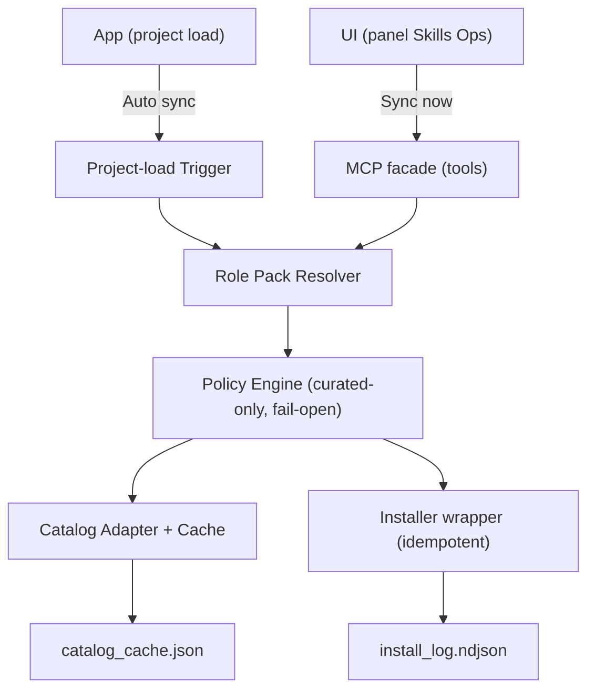
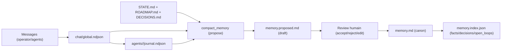
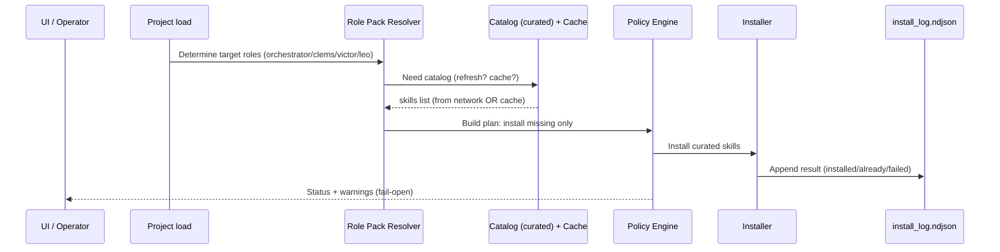

# Plan Papier - Skills Download + Memoire V2 (Cockpit only)

Objectif: cadrer le projet. Zero code ici. Si tu lis ca, tu dois comprendre:
- pourquoi on le fait,
- ce qu on construit (et ce qu on refuse de construire),
- comment ca marche (schemas),
- comment on verifie (scenarios),
- ou on stocke quoi (arborescence).

---

## 1) Le probleme (version simple)

Aujourd hui, tu as:
- Des agents (@clems, @victor, @leo) + un orchestrateur.
- Une memoire par agent (en theorie) mais pas vraiment exploitable: templates vides, pas d index, pas de "points cle" facilement retrouvables.
- Des roles, mais pas de "viser direct": un agent peut demarrer sans cap clair (current_task vide).
- Des skills utiles, mais pas de pipeline standard pour:
  - lister un catalog fiable,
  - installer automatiquement ce qui manque,
  - appliquer des packs par role,
  - afficher un statut lisible (UI + MCP),
  - survivre offline (fail-open).

Donc: tu as du potentiel, mais pas l "operating system" pour le rendre automatique, lisible, et robuste.

---

## 2) Ce qu on veut (objectif produit)

### A) Skills Ops V1
Une couche "ops" simple qui fait 4 trucs:
1. Lister les skills "curated" disponibles (catalog).
2. Installer automatiquement les skills manquants (idempotent = pas de reinstall inutile).
3. Appliquer un pack de skills par role (orchestrateur/clems/victor/leo) + overrides par agent.
4. Exposer un statut clair:
   - dans l UI (un panneau),
   - via MCP (tools list/sync),
   - via des logs.

### B) Memoire V2
Une memoire utile au quotidien, sans magie dangereuse:
1. Compacter sans detruire: on propose, l humain valide.
2. Indexer ce qui compte: facts, decisions, open loops (taches ouvertes), liens.
3. Rendre le stockage lisible (arborescence + schema memoire).

---

## 3) Garde-fous (scope / out of scope)

### In
- Project id: `cockpit` only (no demo/evozina/motherload).
- Skills: source "curated only" (catalog officiel/curated).
- Mode: full-auto.
- Trigger: au chargement du projet (project load).
- Failure policy: fail-open (pas de crash si reseau down).
- Packs: role packs + overrides par agent.
- Memoire: index local par agent/projet.

### Out
- Installer depuis un repo GitHub arbitraire (non curated).
- Vector DB / RAG / retrieval cross-project.
- Migration historique lourde.

---

## 4) Lexique (pour parler la meme langue)

- Skill: un dossier avec un `SKILL.md` (instructions + workflow).
- Curated catalog: la liste autorisee. Si c est pas dedans: refuse.
- Pack (role pack): une liste de skills recommandee pour un role.
- Override: un ajout/suppression de skill specifique a un agent.
- Fail-open: si reseau KO, on continue quand meme (avec warning + cache).
- Idempotent: relancer la sync ne casse rien et ne reinstalle pas inutilement.
- Project load: moment ou tu ouvres/actives le projet cockpit dans l app.

---

## 5) User stories (concret)

### Orchestrateur
- "Quand j ouvre cockpit, je veux un setup stable: catalog connu, skills indispensables installes, et un statut lisible."

### @clems (lead / plan / decisions)
- "Je veux viser direct: si current_task est vide, je veux un focus par defaut base sur mon role."
- "Je veux un pack de skills pour cadrer, prioriser, ecrire des ADR, et deleguer proprement."

### @victor (core / infra)
- "Je veux un pipeline skills fiable: curated-only, idempotent, logs propres, et outils MCP testables."

### @leo (UI)
- "Je veux une UI qui dit la verite: combien de skills, dernier sync, erreurs, et un bouton Sync now."

---

## 6) Architecture cible (papier)

On se decompose en petits blocs. Chaque bloc doit etre testable.

- A) Skills Catalog Adapter
  - Fetch + cache du catalog curated.
- B) Skills Installer Policy Engine
  - Regles: curated-only, fail-open, idempotent.
- C) Role Pack Resolver
  - Choisit les skills pour un role + applique overrides.
- D) Project-load Sync Trigger
  - Lance la sync au bon moment (pas en boucle).
- E) Memory Compaction + Memory Indexer
  - Propose une memoire compacte + genere un index.
- F) MCP facade
  - `list_skills_catalog` et `sync_skills`.
- G) UI status panel
  - Affiche et declenche.

Schema (vue d ensemble):



---

## 7) Data model (settings + fichiers)

### 7.1 Settings (projet)

On ajoute des champs dans `<projects_root>/<project_id>/settings.json` (schema papier).

Projects root (canon runtime):
- macOS: `~/Library/Application Support/Cockpit/projects`
- dev (repo local, uniquement si explicite): `.../Desktop/Cockpit/control/projects`

```json
{
  "skills_policy": {
    "source": "curated",
    "install_mode": "full_auto",
    "trigger": "project_load",
    "failure_policy": "fail_open",
    "last_sync_at": "2026-02-12T20:15:00Z"
  },
  "role_skill_packs": {
    "orchestrator": ["openai-docs", "skill-installer"],
    "clems": ["skill-creator"],
    "victor": ["skill-installer"],
    "leo": ["vercel-deploy"]
  },
  "agent_skill_overrides": {
    "clems": { "add": [], "remove": [] }
  },
  "role_focus": {
    "orchestrator": "Garde le systeme stable, sync skills, et expose un statut clair.",
    "clems": "Cadrage: objectifs, scope, decisions (ADR), delegation.",
    "victor": "Core: policies, idempotence, logs, MCP tooling.",
    "leo": "UI: panneau Skills Ops + statuts + bouton Sync now."
  }
}
```

Notes:
- Exemple seulement. Le vrai pack par role se decide en cadrage (voir section Scenarios + Work breakdown).
- `role_focus` sert de "viser direct" si `current_task` est vide.

### 7.2 Fichiers runtime proposes (projet cockpit)

- `<projects_root>/<project_id>/skills/catalog_cache.json`
  - Cache du catalog.
- `<projects_root>/<project_id>/skills/install_log.ndjson`
  - Logs append-only d installation.
- `<projects_root>/<project_id>/agents/<agent>/memory.index.json`
  - Index lisible de la memoire, genere automatiquement.

---

## 8) Arborescence des "cases" (dossiers)

```text
<projects_root>/<project_id>/
|- agents/
|  |- clems/
|  |  |- state.json
|  |  |- journal.ndjson
|  |  |- memory.md
|  |  |- memory.proposed.md
|  |  `- memory.index.json
|  |- victor/
|  |  |- state.json
|  |  |- journal.ndjson
|  |  |- memory.md
|  |  `- memory.index.json
|  `- leo/
|     |- state.json
|     |- journal.ndjson
|     |- memory.md
|     `- memory.index.json
|- chat/
|  |- global.ndjson
|  `- threads/*.ndjson
|- runs/
|  |- requests.ndjson
|  |- inbox/*.ndjson
|  `- auto_mode_state.json
|- skills/
|  |- catalog_cache.json
|  `- install_log.ndjson
|- STATE.md
|- ROADMAP.md
|- DECISIONS.md
`- settings.json
```

Lecture rapide:
- `chat/` = verite brute des conversations projet.
- `agents/<agent>/journal.ndjson` = notes agent (append-only).
- `agents/<agent>/memory.md` = memoire "curated" (humain).
- `memory.proposed.md` = proposition auto (a valider).
- `memory.index.json` = index machine lisible (facts/decisions/open loops).
- `skills/` = cache + logs skills (obs, debug).

---

## 9) Flux memoire (Memoire V2)

Objectif: avoir une memoire utile sans casser l existant.



Regles:
- On ne modifie jamais `memory.md` automatiquement.
- On ecrit un draft (`memory.proposed.md`).
- L humain decide.
- L index est regenere a partir de la memoire canon + sources.

Caps (pour rester utile et deterministe):
- Output total: <= 120 lignes.
- Par section: 1-5 items max.
- Recent signals: N=10, trunc 280 chars.
- Dedup simple (lignes uniques), ordre stable.

---

## 10) Flux skills (Skills Ops V1)

Objectif: "tu ouvres le projet, et ca se met en place tout seul".



Fail-open (cas reseau KO):
- Si cache present: on continue sur cache, on log un warning.
- Si cache absent: on n installe rien, on log un warning, mais l app continue.

---

## 11) Scenarios (ce que tu testes "papier" avant de coder)

Chaque scenario = "Etant donne X, quand Y, alors Z" + ce que tu vois.

### Scenario 1: Project load cockpit + reseau OK
- Given: catalog accessible.
- When: tu charges le projet cockpit.
- Then:
  - sync pack role pour orchestrator/clems/victor/leo,
  - cache catalog ecrit,
  - install_log append,
  - UI montre "OK" + counts.

### Scenario 2: Project load cockpit + reseau KO
- Given: pas d internet.
- When: tu charges cockpit.
- Then:
  - fail-open: pas de crash,
  - si cache existe: on utilise le cache,
  - sinon: warning clair + aucun install.

### Scenario 3: Demande install skill hors curated
- Given: quelqu un propose "installe mon-skill-random".
- When: sync_skills recoit un nom pas dans curated.
- Then:
  - reject hard (policy violation),
  - log explicite,
  - aucun effet de bord.

### Scenario 4: Sync rerun idempotent
- Given: skills deja installes.
- When: tu relances Sync now.
- Then:
  - 0 reinstall inutile,
  - resultat "already_present" majoritaire,
  - temps court.

### Scenario 5: Compaction memoire (non destructif)
- Given: `journal.ndjson` + `chat/global.ndjson` + `DECISIONS.md`.
- When: tu lances compaction.
- Then:
  - `memory.proposed.md` genere,
  - `memory.md` inchangee,
  - open loops identifies (taches a fermer).

### Scenario 6: Index memoire
- Given: `memory.md` existe.
- When: indexer.
- Then:
  - `memory.index.json` cree,
  - sections claires: facts, decisions, open_loops, links.

### Scenario 7 (bonus): Partial install failure
- Given: une skill plante a installer.
- When: sync.
- Then:
  - on installe le reste,
  - on log le failed + warning,
  - l app continue (fail-open).

---

## 12) KPIs (comment tu sais que ca marche)

- Sync on load: >= 95% sans intervention.
- Median sync: <= 10s.
- Idempotence: >= 90% de reinstalls evites apres premiere sync.
- Robustesse: 0 crash app lie au download skills.
- Memoire: index genere pour les 3 roles principaux (clems/victor/leo).

---

## 13) Work breakdown (epics -> issues papier)

### Epic A - Skills Ops Core (owner: @victor)
- ISSUE-SK-001: Catalog fetch + cache + fallback.
- ISSUE-SK-002: Policy engine (curated-only, fail-open).
- ISSUE-SK-003: Installer wrapper + idempotence.

### Epic B - Role packs + orchestration (owner: @clems)
- ISSUE-SK-004: Packs defaults + overrides.
- ISSUE-SK-005: Auto sync au project load (pas en boucle).
- ISSUE-SK-006: Focus direct (role_focus -> current_task si vide).

### Epic C - UI + observabilite (owner: @leo)
- ISSUE-SK-007: Panel sidebar Skills Ops.
- ISSUE-SK-008: Bouton Sync now + feedback user.

### Epic D - Memoire V2 (owner: @victor pour tooling, @clems pour doc)
- ISSUE-MEM-001: memory.index.json generator.
- ISSUE-MEM-002: compaction plus utile (caps + open loops).
- ISSUE-MEM-003: doc visuelle + arborescence (ce fichier est le draft).

### Epic E - MCP + QA (owner: @victor + @agent-3)
- ISSUE-MCP-001: tool list_skills_catalog.
- ISSUE-MCP-002: tool sync_skills (dry_run inclus).
- ISSUE-QA-001: matrix de verif skills/memoire.

---

## 14) Risques (et comment on les tue)

- GitHub down:
  - cache + fail-open + warning clair.
- Drift de scope (multi-project, RAG, etc):
  - decision: cockpit only, point.
- Bruit memoire:
  - caps stricts + index deterministic.
- Confusion user:
  - UI dit "quoi, quand, combien, pourquoi ca a fail".

---

## 15) Quand tu bascules en implementation (checklist)

Avant d ecrire 1 ligne de code:
1. Valider la liste "curated" exacte + format du catalog.
2. Decider les packs par role (liste initiale, petite).
3. Valider les champs settings (noms + defaults).
4. Valider les scenarios 1-6 (acceptance).
5. Ecrire 1 ADR si une decision change (ex: trigger, scope).
