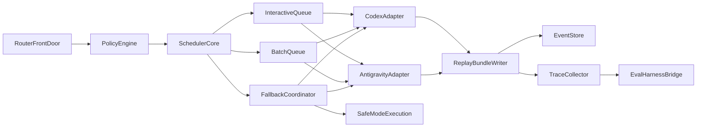

# 02_ARCHITECTURE - Router and Orchestration Graph

## Context
- This document defines the runtime architecture for Variant C.
- Primary objective: deterministic, fair, and resilient orchestration across Codex, Antigravity, and optional providers.

## Problem statement
- Without explicit orchestration contracts, multi-agent execution becomes non-deterministic, hard to replay, and expensive under failure.
- Router behavior must remain stable under burst traffic while honoring policy constraints and resource budgets.

## Proposed design
### 1) Layered architecture
- Layer A: Intake and Policy
  - RouterFrontDoor
  - PolicyEngine
  - ApprovalGate
- Layer B: Scheduling and Dispatch
  - SchedulerCore
  - QueueManager
  - FairnessController
  - FallbackCoordinator
- Layer C: Provider Execution
  - CodexAdapter
  - AntigravityAdapter
  - OptionalProviderAdapter (disabled by default)
- Layer D: Durability and Observability
  - ReplayBundleWriter
  - EventStore
  - TraceCollector
  - EvalHarnessBridge

### 2) Orchestration graph (logical)

### 3) Scheduling policy
- Queue classes:
  - interactive: low latency operator-facing work.
  - batch: heavy non-urgent runs.
- Dispatch rule:
  - weighted fair scheduling with dynamic credits.
  - each queue accrues credits by wait time and priority tier.
- Fairness guard:
  - if one class exceeds max starvation window, force class switch.
- Anti-thundering-herd logic:
  - token bucket admission per queue.
  - jittered retry windows.
  - per-project concurrency caps.

### 4) Fallback tiers
- Tier 0: bounded retry on same provider.
- Tier 1: alternate provider with equivalent capability class.
- Tier 2: degrade toolset and continue in safe mode.
- Tier 3: stop dispatch and request @clems decision.

### 5) Deterministic replay model
- Every orchestration decision emits deterministic events:
  - route_selected
  - queue_admitted
  - run_dispatched
  - run_failed
  - fallback_applied
  - run_completed
- Replay uses event log + trace context + policy log.
- Checksum ensures bundle integrity before replay.

## Interfaces and contracts
### RouterFrontDoor API contract
- Input:
  - `run_id`
  - `project_id`
  - `mission_type`
  - `requested_capability`
  - `deadline_hint`
  - `budget_envelope`
  - `traceparent`
- Output:
  - `dispatch_decision`
  - `queue_class`
  - `provider_candidate_set`
  - `policy_flags`
  - `replay_bundle_id`
- Error contract:
  - `POLICY_DENY`
  - `BUDGET_EXCEEDED`
  - `NO_PROVIDER_AVAILABLE`
  - `QUEUE_OVERLOADED`

### SchedulerCore contract
- Input:
  - queue depths
  - fairness credits
  - per-project caps
  - active provider health
- Output:
  - run admission decision
  - selected queue
  - selected provider
  - fallback tier
- Invariants:
  - no starvation over configured window
  - no policy bypass
  - no dispatch without replay context

### ProviderAdapter contract
- Input:
  - normalized execution payload
  - policy guardrails
  - tool scope
- Output:
  - result payload
  - usage metrics
  - failure class
- Failure classes:
  - timeout
  - transient provider error
  - permanent capability mismatch
  - policy violation

### Replay bundle contract
- `bundle_id`
- `run_id`
- `event_sequence[]`
- `tool_calls[]`
- `policy_decisions[]`
- `trace_ids[]`
- `checksums`
- `created_at`

## Failure modes
- FM-01: fairness controller drift causes queue starvation.
- FM-02: provider health signal stale, wrong fallback decisions.
- FM-03: retry storms amplify queue load.
- FM-04: replay bundles missing events due to writer failure.
- FM-05: optional provider adapter introduces contract mismatch.
- FM-06: budget envelope ignored during burst load.

## Validation strategy
- VS-01: fairness soak test with mixed interactive/batch loads for 24h.
- VS-02: provider outage chaos test verifies Tier 0-3 fallbacks.
- VS-03: replay determinism test compares checksum and event sequence.
- VS-04: policy fuzzing test ensures deny rules block off-scope actions.
- VS-05: cost guardrail test trips budget stop and escalation.

## Rollout/rollback
- Rollout stages:
  - Stage A: deploy RouterFrontDoor + PolicyEngine + EventStore.
  - Stage B: activate SchedulerCore + QueueManager with safe defaults.
  - Stage C: enable dynamic fairness and fallback tiers.
  - Stage D: wire EvalHarnessBridge and release gates.
- Rollback strategy:
  - disable optional provider adapter via feature flag.
  - switch scheduler to fixed round-robin safe mode.
  - force Tier 3 hold on repeated failure bursts.

## Risks and mitigations
- R-ARCH-01: over-complex scheduler logic hurts operability.
  - Mitigation: keep deterministic state machine and explicit metrics.
- R-ARCH-02: adapter divergence across providers.
  - Mitigation: strict normalized adapter interface with contract tests.
- R-ARCH-03: replay storage growth.
  - Mitigation: retention and compaction policy in memory design.

## Resource impact
- Team allocation:
  - 12 devs router/scheduler
  - 8 devs provider adapters
  - 8 devs replay/event infra
  - 6 devs eval/observability
  - 6 devs platform/integration
- Infra:
  - queue store cluster
  - trace collector
  - replay storage
- Cost and timeline links:
  - `07_RESOURCE_BUDGET.md`
  - `06_ROADMAP_40DEVS.md`

## Source pointers
- SRC-P1,SRC-P5,SRC-P6,SRC-P8,SRC-P9,SRC-P10,SRC-R1,SRC-R2,SRC-R4,SRC-R6,SRC-D1,SRC-D2.
- Assumptions: ASSUMPTION-A2, ASSUMPTION-A3, ASSUMPTION-A7.
