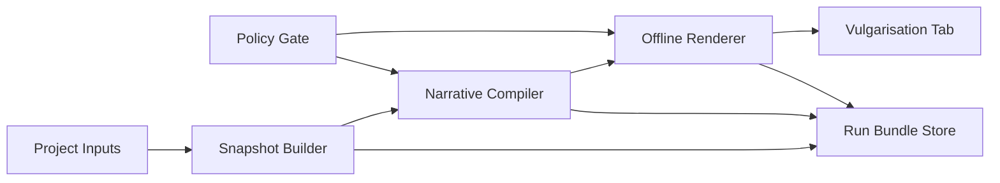
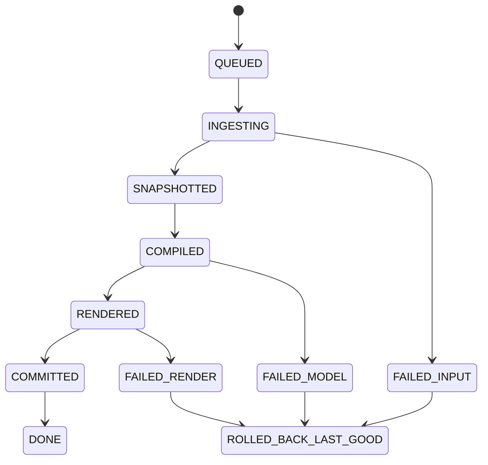
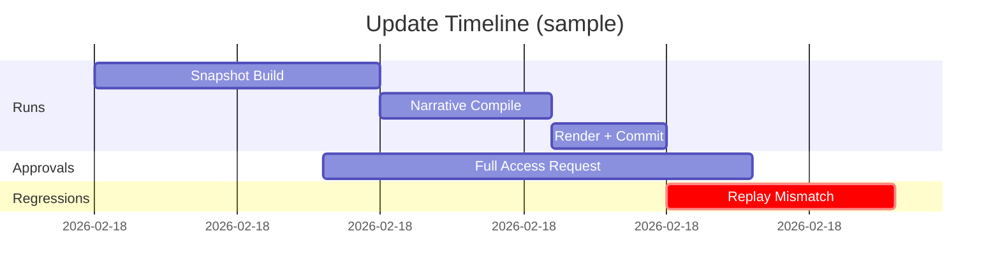
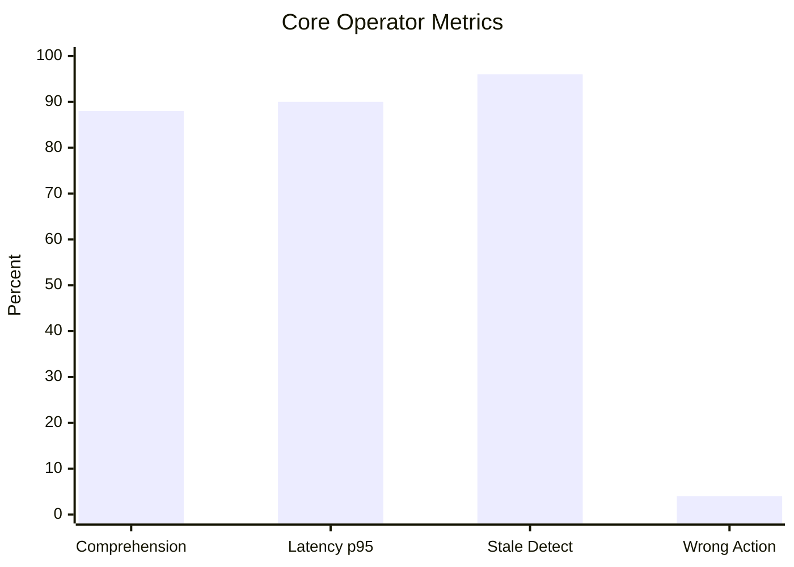

# Cockpit V2 R1 - Vulgarisation Tab Specification (Variant F)

## Context
The vulgarisation tab is the operator front line. It must turn complex project state into immediate understanding while preserving data provenance, policy safety, and deterministic update behavior.

## Problem statement
Operators currently spend too much time reconstructing context from scattered artifacts. In pressure situations, this causes slow decisions and avoidable errors. We need a one-screen summary that communicates what matters first, then supports drill-down.

## Proposed design
### UX objective
- Operator can answer the 5 critical triage questions in <=60 seconds.
- Operator can identify blocker owner, freshness risk, and approval status in <=10 seconds.

### Visual hierarchy
Reading order (strict):
1. Top command strip: phase, objective, freshness, risk state.
2. Left summary rail: blockers, failing tests, next milestone.
3. Center architecture panel: module map + current execution state.
4. Right action rail: approvals, blocked actions, owner cues.
5. Bottom detail tabs: timeline, costs, skills, memory highlights.

Design rules:
- Max 7 primary cards on first screen [P8].
- Position and length encodings for critical comparisons [P9].
- Color is secondary signal; text labels always present (S2).
- Every chart has a textual fallback block.

### Dashboard contracts
Required sections:
- Project summary
- Architecture overview
- Timeline
- Progress panel
- Cost and usage panel
- Skill inventory

Freshness metadata (always visible):
- `generated_at`
- `source_snapshot`
- stale warning thresholds: `warn >24h`, `critical >72h`

### Update cadence
- Manual command: `Update Vulgarisation`.
- Optional scheduler: every 5 minutes in pilot mode.
- Auto-refresh behavior:
  - metadata tick every 30s
  - full refresh only after successful generation

### Pressure mode behavior
When `status=critical`:
- Collapse low-priority panels by default.
- Expand blockers, approvals, failing tests automatically.
- Surface clear next action and owner.

## Interfaces and contracts
### Input contract
Inputs are project-local only:
- `STATE.md`, `ROADMAP.md`, `DECISIONS.md`
- `agents/*/state.json`
- `chat/*.ndjson`
- `skills/skills.lock.json`
- `vulgarisation/costs.json`

### Output contract
- HTML: `control/projects/<project_id>/vulgarisation/index.html`
- Assets: `control/projects/<project_id>/vulgarisation/assets/`
- Log: `control/projects/<project_id>/vulgarisation/update.log`

### Panel payload contract
```json
{
  "panel_id": "progress",
  "status": "warn",
  "freshness_hours": 5.2,
  "headline": "2 blockers, 4 failing tests",
  "items": [
    {"label": "Blocker owner", "value": "@victor"},
    {"label": "Next milestone", "value": "M4 - Eval soft gate"}
  ],
  "fallback_text": "Progress data partially unavailable."
}
```

### Accessibility contract
- Keyboard only navigation across all cards.
- ARIA landmarks for top strip, summary rail, action rail, detail tabs (S4).
- Contrast and text size consistent with WCAG 2.2 AA (S2).

## Failure modes
- Missing panel data: panel renders fallback text, never blank.
- Stale snapshot: force warning badge and disable risky quick actions.
- Chart render failure: switch to table and preserve numeric values.
- Update crash: keep last-good HTML and log stack trace.
- Policy denied action: show denial reason and approval path.

## Validation strategy
### 60-second operator comprehension acceptance test
Protocol:
1. Load dashboard from local file path.
2. Start 60-second timer.
3. Operator answers 5 critical questions.
4. Score and confidence logged.

Pass criteria:
- >=4/5 correct in <=60 seconds.
- Group pass rate >=85 percent for release floor.

### Additional UX validation
- Misread rate by chart type (target <=8 percent).
- Time-to-first-correct-owner (target <=12 seconds).
- Stale warning detection rate (target >=95 percent).

### Technical validation
- Offline open test on desktop and mobile viewport.
- Schema contract test for each panel payload.
- Stress test with empty history and malformed metrics.

## Rollout/rollback
Rollout:
1. Deploy hidden tab and record telemetry.
2. Pilot with operators on assisted mode.
3. Enable pressure mode defaults after 2 clean weeks.
4. Promote to default tab for pilot cohort.

Rollback:
- Disable pressure mode auto-collapse.
- Revert to previous visual bundle.
- Keep essential summary strip and timeline only.
- Trigger postmortem if comprehension gate fails two cycles.

## Risks and mitigations
- Risk: visual clutter from too many alerts. Mitigation: alert budget and strict ranking.
- Risk: over-reliance on colors. Mitigation: text tags, icons, and priority labels.
- Risk: operator distrust from occasional stale panels. Mitigation: explicit freshness and source hashes.
- Risk: mobile layout loses critical context. Mitigation: mobile first-screen parity checklist.

## Resource impact
- Frontend effort: substantial initial IA and usability testing.
- Backend effort: moderate for panel contracts and freshness metadata.
- QA effort: high for comprehension studies and visual regressions.
- Expected value: faster triage and fewer wrong actions under stress.

## Required diagrams
### 1) High-level block diagram


### 2) Orchestration state-flow diagram


### 3) Timeline chart


### 4) Metrics bar chart

