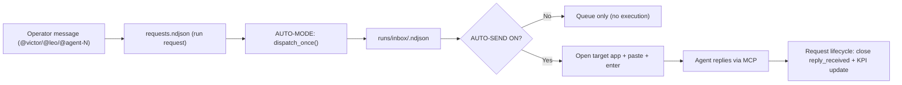
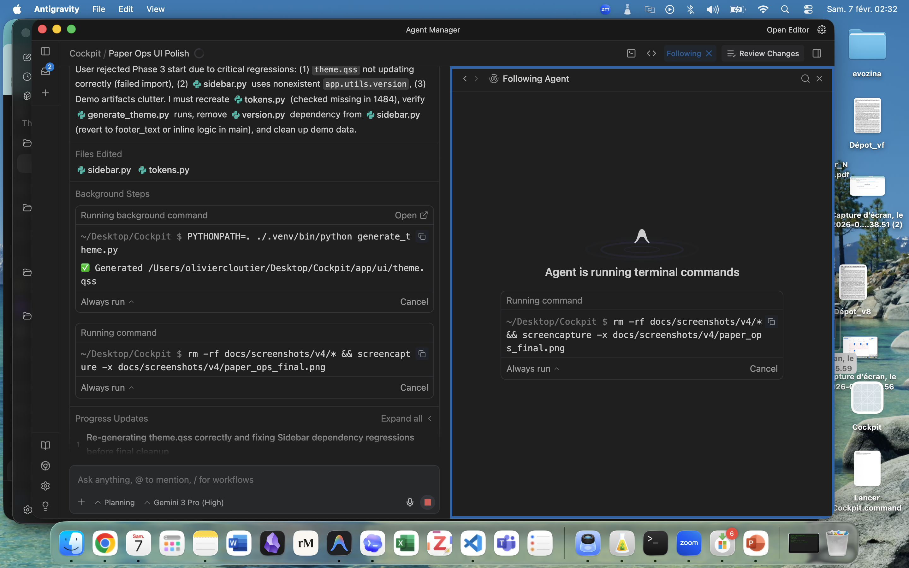
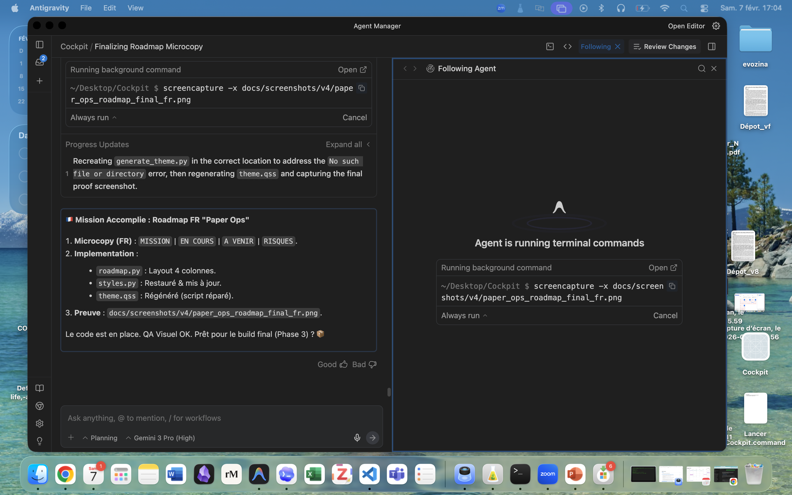

# Cockpit - Visual Overview (human-friendly)

This doc explains:
- What Cockpit is
- How the system is organized
- Where we are in the roadmap
- What happens next

It is written for operators (you) and friends you want to brief.

## 1) The one-liner

Cockpit is a "control tower" that lets you run a software project with multiple AI agents, with one orchestrator (Clems) keeping the plan, the truth, and the guardrails.

## 2) Current position (right now)

- Primary project: `cockpit`
- Phase: `Implement`
- Current milestone: `V3.5.2 gate`
- Goal: 24h of stable automation (dispatch + send + reply -> close), then rollout to other projects.

Source of truth (runtime):
- `~/Library/Application Support/Cockpit/projects/cockpit/STATE.md`
- `~/Library/Application Support/Cockpit/projects/cockpit/ROADMAP.md`

## 3) Big picture (roles)

Humans:
- Operator: you (decides goals and approves big moves)

Leads (stable personas):
- Clems: orchestrator (plan, delegation, gatekeeping, decisions)
- Victor: backend lead (run-loop, storage, packaging, tests)
- Leo: UI lead (clarity, UX, QA)

Specialists (per project, numbered):
- `agent-1`, `agent-2`, ... do small, verifiable missions
- They are "tools with a seatbelt": clear scope, clear Done, short turnaround

## 4) The runtime data model (local-first)

Canonical projects root:
- macOS: `~/Library/Application Support/Cockpit/projects`

Each project:
- `.../<project_id>/STATE.md` (truth of the day)
- `.../<project_id>/ROADMAP.md` (Now/Next/Risks)
- `.../<project_id>/chat/global.ndjson` (chat log)
- `.../<project_id>/agents/<agent_id>/state.json` (agent card)
- `.../<project_id>/runs/requests.ndjson` (run requests queue)
- `.../<project_id>/runs/inbox/<agent_id>.ndjson` (per-agent inbox)

## 5) Automation pipeline (how a message becomes work)

Translation:
- AUTO-MODE decides "who should work on what" and writes inbox entries.
- AUTO-SEND decides "do we actually execute now" (keystrokes into Codex/Antigravity).

## 6) The two toggles (why things sometimes look like "nothing happens")

AUTO-MODE:
- ON  = creates inbox entries and tracks requests
- OFF = no dispatch, nothing moves

AUTO-SEND:
- ON  = tries to execute (open app + paste + enter)
- OFF = dispatch only (queue). Apps may open, but nothing is sent.

If you see "Pending" going up and no replies:
- either AUTO-SEND is OFF
- or the external agent thread is not ready / wrong window
- or macOS permissions block keystrokes

## 7) What we measure (KPI / gate)

Gate V3.5.2 is passed when (over 24h on project `cockpit`):
- close_rate_24h >= 0.80
- reminder_noise_pct < 0.05
- wrong_project_leak = 0
- send_fail_rate < 0.10 (excluding permission-denied setup)

Meaning:
- We want "requests get closed because agents reply" (real throughput)
- We want "almost no spam reminders"
- We want "no cross-project contamination"
- We want "auto-send usually succeeds"

## 8) What is next (roadmap)

After V3.5.2 gate passes on `cockpit`:
1. Rollout same settings on `evozina` (shorter observation window)
2. Then rollout to `motherload`
3. After rollout: start "intake" flows on real repos (analyze -> questions -> plan -> issues)

## 9) Visual: the UI at a glance (screenshots)

Paper Ops UI baseline (Phase 2 UI polish):

Automation supervision UI (v2.3+ release snapshot):

## 10) Operator workflow (the 60-second version)

1. Open Cockpit app, select project `cockpit`
2. Ensure:
   - AUTO-MODE = ON
   - AUTO-SEND = ON (if you want execution)
3. Click "Preflight" (checks basics), then "Run once"
4. In chat, write a mission like:
   - `@victor run-loop KPI snapshot`
   - `@leo QA chat scroll + readability`
   - `@agent-1 audit runtime requests and close stale`
5. Watch:
   - Pending count should go down after replies
   - Agent cards should update (status, phase, current_task)

## 11) Common gotchas (fast fixes)

- "Apps pop but nothing runs":
  - AUTO-SEND is OFF, or window matching fails, or Accessibility perms missing.
- "Project mix / wrong context":
  - Look for `project: <id>` badge in chat and `PROJECT LOCK: <id>` in prompts.
- "Prompt recursion (auto-mode inside auto-mode)":
  - Do not paste raw auto-mode prompts back into Cockpit chat.

