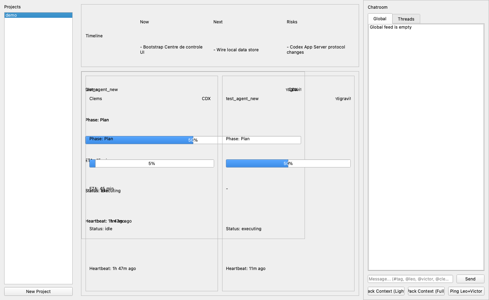

# Centre de controle — Docs/Runbook (PR1)

## Run (Python >= 3.11)

Notes:
- Project targets Python >= 3.11 (3.12 OK).
- The PyPI package "mcp" requires Python >= 3.10, but we standardize higher for simplicity.

```bash
cd /Users/oliviercloutier/Desktop/Cockpit
python3 --version  # must be >= 3.11
python3 -m venv venv
source venv/bin/activate
python -m pip install -r requirements.txt
./launch_cockpit.sh
```

## Daily launch policy (Wave09)

- During active implementation, use **Dev Live** as source of truth:
  - `./launch_cockpit.sh`
- Treat `dist/Centre de controle.app` as a release snapshot only:
  - rebuild required for new code/UI.

Install a Dock launcher that always opens Dev Live:

```bash
cd /Users/oliviercloutier/Desktop/Cockpit
scripts/packaging/install_dev_live_launcher.sh
```

In app runtime panel:
- `Mode: DEV LIVE` -> expected for daily implementation.
- `Mode: RELEASE` -> snapshot build (no code auto-update).
- In `DEV LIVE`, two dock icons can appear (launcher + python rocket). This is expected.

Version check:
- The window title shows: `Centre de controle - <branch>@<sha><*dirty>`
- Sidebar footer shows the same stamp plus the active data root path.
- Expected default is `~/Library/Application Support/Cockpit/projects`.
- Use `COCKPIT_DATA_DIR=repo` only for explicit repo-local dev sessions.

## V1 Local Dev Release (Phase 3)

Release note (short):
- V1 local dev release is live. Paper Ops UI is applied, chat actions are compact, and the version stamp is visible. Packaging is deferred to V2.

QA checklist (V1):
1. Launch app: `./.venv/bin/python app/main.py`
2. Title shows `main@<sha>`
3. Resize window: no clipping in chat action row
4. Click `Ping Team`: ACK appears in chat and heartbeat updates

## Run MCP Server (stdio)

```bash
cd /Users/oliviercloutier/Desktop/Cockpit
source venv/bin/activate
python control/mcp_server.py
```

## Runtime Drift Recovery (App Support canonical)

Strict inbox prune (with archive backup):

```bash
cd /Users/oliviercloutier/Desktop/Cockpit
./.venv/bin/python scripts/auto_mode_inbox_prune.py --project cockpit --data-dir app --agent victor
```

Dry-run first:

```bash
cd /Users/oliviercloutier/Desktop/Cockpit
./.venv/bin/python scripts/auto_mode_inbox_prune.py --project cockpit --data-dir app --agent victor --dry-run
```

Rollback:
- Restore the latest file from `~/Library/Application Support/Cockpit/projects/<project>/runs/inbox/archive/`.

## UI Layout (fixed)

- **Sidebar (left)**: Projects list + `New Project` button.
- **Top center**: Roadmap (timeline + Now/Next/Risks).
- **Center**: Single grid of agents (CDX + AG mixed). Each card shows badge, phase, percent, ETA, status, heartbeat.
- **Right panel**: Chatroom tabs (Global + Threads), composer, `Pack Context` actions, `Ping Leo+Victor`.

## Local Data Structure (V1)

```
control/projects/<project_id>/
  agents/<agent_id>/state.json
  agents/<agent_id>/journal.ndjson
  chat/global.ndjson
  chat/threads/<tag>.ndjson
  roadmap.yml
  ROADMAP.md
  STATE.md
  DECISIONS.md
  settings.json
```

## Screenshot


