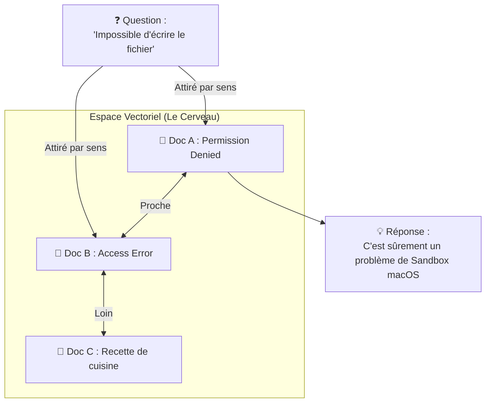
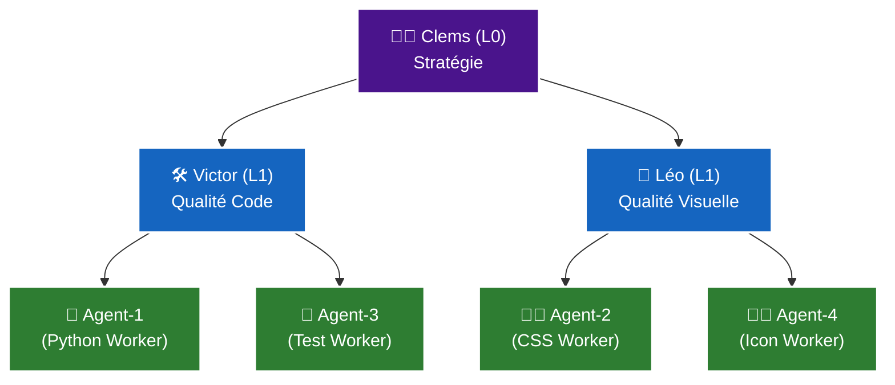

# 📘 Cockpit V2 : La Vision "Organisme" (Vulgarisation Détaillée)

> **Pour :** Olivier
> **Objectif :** Comprendre l'architecture V2 sans se noyer dans le code Python.
> **Format :** Guide Visuel & Conceptuel

---

## 1. Le Changement de Paradigme
**De l'Outil à l'Organisme**

Actuellement, Cockpit fonctionne comme une **Boîte à Outils**.
*   Quand tu ouvres la boîte, les outils sont là (Victor, Léo).
*   Quand tu la fermes, ils cessent d'exister.
*   Si tu prends un marteau pour planter un clou sur le Projet A, il ne se "souvient" pas comment il a fait quand tu ouvres le Projet B.

La Vision V2 transforme Cockpit en un **Organisme Vivant**.
*   Les agents ont une **mémoire**.
*   Ils apprennent des **compétences** (Skills).
*   Ils travaillent en **équipe hiérarchisée**.

### Représentation Visuelle

```mermaid
graph TD
    subgraph "V1 : La Boîte à Outils (Actuel)"
        U1[👤 Olivier] --> T1[🛠️ Outil Victor]
        U1 --> T2[🎨 Outil Léo]
        T1 -.->|Oublie tout| U1
        T2 -.->|Oublie tout| U1
    end

    subgraph "V2 : L'Organisme (Futur)"
        U2[👤 Olivier] --> C[🧠 Cerveau Central (Clems)]
        C -->|Délègue| M[🤝 Managers (Léo/Victor)]
        M -->|Exécutent| W[🤖 Workers (Agents X)]
        W -->|Apprennent| KB[(📚 Mémoire Partagée)]
        KB -->|Informe| C
    end
```

---

## 2. L'Architecture "OpenClaw" Expliquée
**Pourquoi c'est le modèle à suivre**

Imagine OpenClaw non pas comme un logiciel, mais comme une **Usine Autonome**.

1.  **Le Contremaître (Task Manager) :** Il ne dort jamais. Il surveille qui travaille, combien ça coûte, et si quelqu'un est bloqué.
2.  **Les Fiches de Poste (SOUL.md) :** Chaque employé a un dossier qui explique *qui il est*, pas juste *ce qu'il fait*.
    *   *Exemple :* "Tu es Victor. Tu es un puriste du code. Tu détestes le code sale. Tu vérifies toujours deux fois."
3.  **L'Atelier de Formation (Skill Store) :** Quand un nouvel ouvrier arrive, il va à la bibliothèque et télécharge "Savoir souder" ou "Savoir peindre". Il n'est pas né avec.

**Dans Cockpit V2 :**
On veut cette *structure* (Usine), mais gardée *propre et simple* (Bureau).

---

## 3. La Mémoire : Comment ça marche ? (Vector Store)

C'est souvent le concept le plus flou. Comparons-le à une **Bibliothèque**.

### Mémoire Traditionnelle (Ce qu'on a)
C'est le **"Ctrl+F"** (Recherche par mot-clé).
*   Tu cherches "Bug Permission".
*   Il trouve tous les fichiers où il y a écrit exactement "Bug" et "Permission".
*   *Problème :* Si tu as écrit "Erreur d'accès", il ne trouve rien.

### Mémoire Vectorielle (Ce qu'on veut)
C'est le **"Bibliothécaire Intelligent"** (Recherche Sémantique).
*   Chaque document est transformé en **coordonnées GPS** (vecteurs).
*   Les concepts proches sont stockés physiquement à côté.
    *   "Permission" est garé à côté de "Accès".
    *   "Bug" est garé à côté de "Erreur".
*   Tu demandes : "On a déjà eu des soucis pour écrire des fichiers ?"
*   Le Bibliothécaire regarde dans la zone "Problèmes d'écriture" et te sort le doc "Bug Permission", même si les mots ne sont pas identiques.



---

## 4. La Pyramide de Commandement (L0, L1, L2)
**Pourquoi on ne peut pas juste avoir "plein d'agents"**

Si tu mets 10 personnes dans une pièce sans chef, c'est le chaos. Pour les IA, c'est pareil.

### Niveau 0 : Le Stratège (Clems)
*   **Rôle :** Il ne met pas les mains dans le cambouis. Il a la vision globale.
*   **Analogie :** L'Architecte en Chef.
*   **Job :** Il reçoit ta demande ("Refais le site"), la découpe en gros morceaux, et la donne à ses lieutenants.

### Niveau 1 : Les Lieutenants (Victor & Léo)
*   **Rôle :** Ils sont experts d'un domaine. Ils supervisent la qualité.
*   **Analogie :** Chef de Chantier (Victor) et Directeur Artistique (Léo).
*   **Job :** Ils prennent le gros morceau ("Refais le backend"), le découpent en tâches précises ("Créer API", "Optimiser DB"), et vérifient que c'est bien fait.

### Niveau 2 : Les Ouvriers Spécialisés (Agent-1, Agent-2...)
*   **Rôle :** Ils exécutent. Vite et bien.
*   **Analogie :** Maçon, Électricien, Peintre.
*   **Job :** Ils font une chose à la fois. Ils n'ont pas besoin de connaître tout le projet. Ils ont juste besoin de leur compétence (`[Python]`, `[CSS]`).



---

## 5. Le "Task Manager" Simplifié
**Arrêter de piloter à l'aveugle**

Aujourd'hui, quand tu lances "Auto-Mode", c'est une boîte noire. Tu espères que ça marche.
Le Task Manager V2, c'est ton **Tableau de Bord**.

Imagine un écran à l'aéroport :
*   **VOL AF123 (Clems)** : 🟢 EN VOL (Orchestration en cours)
*   **VOL DL456 (Victor)** : 🟡 RETARDÉ (Attend validation)
*   **VOL BA789 (Léo)** : 🔵 ATTERRI (Tâche terminée)

Plus besoin de demander "Tu fais quoi ?". C'est affiché.
*   **En Mission :** L'agent travaille activement.
*   **En Attente :** L'agent a fini et attend une instruction.
*   **Au Repos :** L'agent est libre.

---

## 6. Pourquoi Codex est un Risque ? (Le point "Q9")

Actuellement, 5 agents sur 7 sont "hébergés" chez Codex (le moteur d'exécution actuel).
C'est comme si toute ton entreprise reposait sur **un seul serveur**.
*   Si le serveur plante 💥, 80% de ta boîte s'arrête.
*   Si le serveur est lent 🐢, tout le monde ralentit.

**La solution V2 : Le Routeur Intelligent.**
*   Si Codex est occupé, on envoie la tâche à Antigravity.
*   Si c'est une petite tâche facile, on l'envoie à un petit modèle local (gratuit).
*   Si c'est une tâche complexe, on paye pour le modèle "Luxe".

C'est ça, la vraie robustesse.

---

## 🔍 Conclusion : Ce que tu vas voir changer

1.  **L'Organisation :** Tu verras une hiérarchie claire. Clems te parle, Victor parle à Clems.
2.  **La Compétence :** Les agents ne diront plus "Je ne sais pas faire". Ils diront "Attends, je télécharge le module React".
3.  **La Mémoire :** Ils arrêteront de refaire les mêmes erreurs d'un projet à l'autre.
