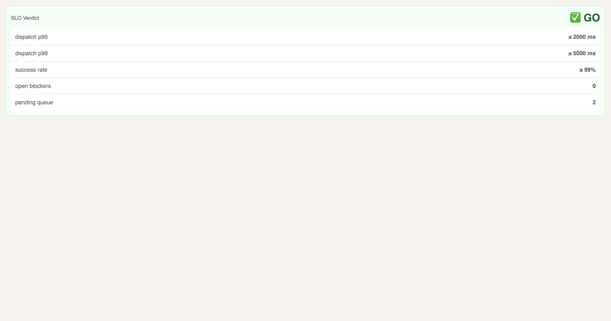
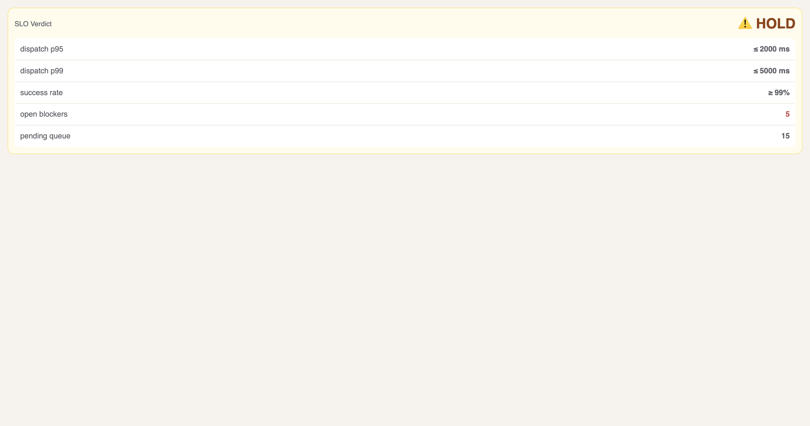
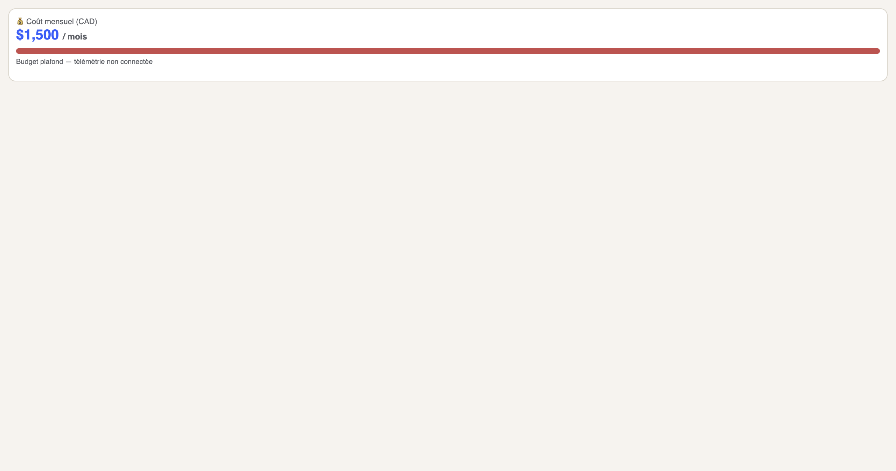
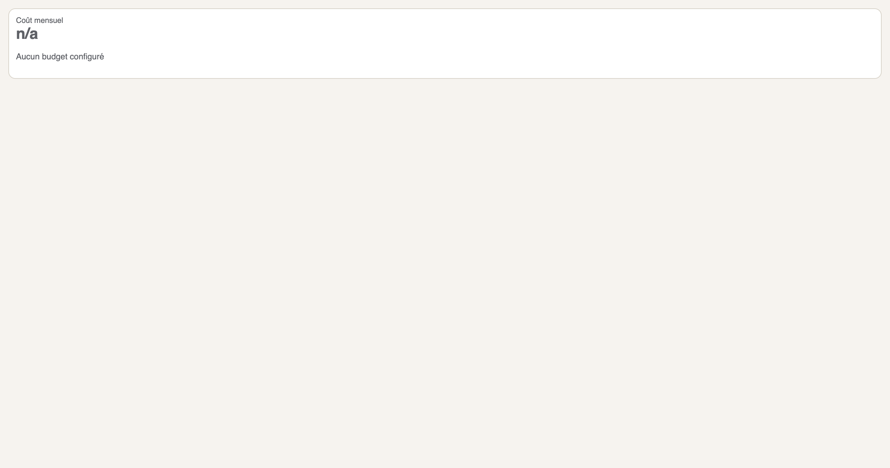

# CP-01 SLO & Cost Panel Evidence — 2026-02-19

**Agent:** @antigravity
**Scope:** Project Pilotage UI (SLO Verdict, Cost Panel)
**Method:** Mocked state injection via `scripts/generate_pilotage_evidence.py`

## Scenario Matrix & Evidence

### 1. SLO Verdict (Normal vs Degraded)

| ID | State | Expected | Result |
|----|-------|----------|--------|
| **SLO-01** | Normal (0 blockers, queue < 3) | 🟢 **GO** Verdict | ✅ PASS |
| **SLO-02** | Degraded (Blockers > 0, Network Down) | 🔴 **HOLD** Verdict | ✅ PASS |

#### Evidence

**SLO-01: Normal State**

**SLO-02: Degraded State**

---

### 2. Cost Panel (Budget vs No-Budget)

| ID | Configuration | Expected | Result |
|----|---------------|----------|--------|
| **COST-01** | Budget Configured ($1,500) | 💰 Display Amount & Bar | ✅ PASS |
| **COST-02** | No Budget ($0) | ⚪️ Display "n/a" | ✅ PASS |

#### Evidence

**COST-01: Budget Configured**

**COST-02: No Budget**

---

## Now / Next / Blockers

- **Now:** Completed evidence generation for SLO and Cost panels. Validated degraded states (Fail-Open/HOLD).
- **Next:** Integrate real telemetry for Cost panel (blocked on Backend).
- **Blockers:** None.
