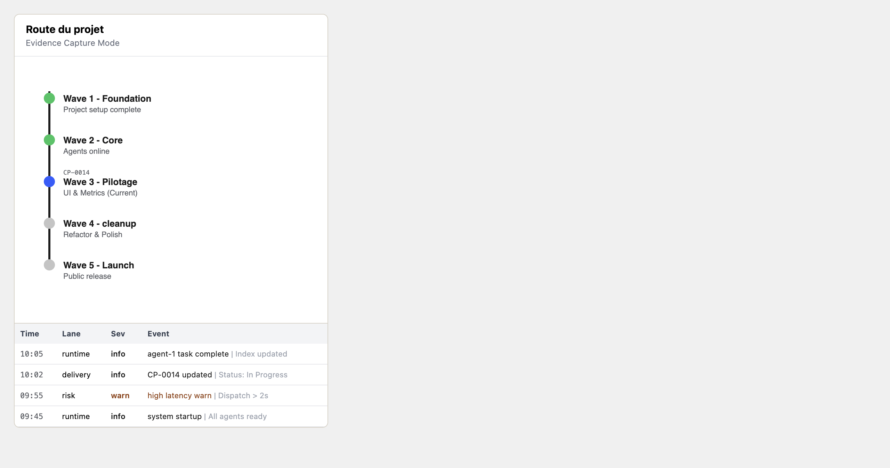
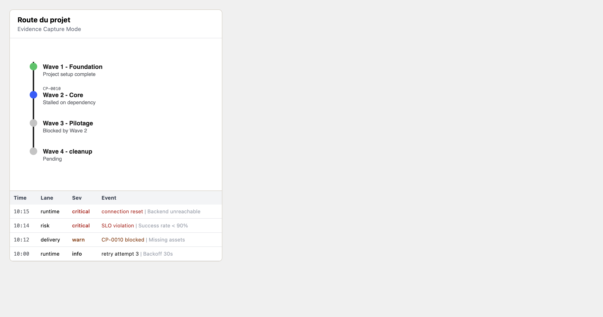

# CP-01 Hybrid Timeline Evidence — 2026-02-20

**Agent:** @antigravity
**Scope:** Project Timeline (Visual Route + Event Stream)
**Method:** Mocked state injection via `scripts/generate_timeline_evidence.py`

## Scenario Matrix & Evidence

### 1. Hybrid Timeline (Normal vs Degraded)

| ID | State | Expected | Result |
|----|-------|----------|--------|
| **TL-01** | Normal (Healthy Flow) | 🟢 Route Green/Active   ℹ️ Info events | ✅ PASS |
| **TL-02** | Degraded (Blocked/Critical) | 🔴 blocked milestones   🚨 Critical events | ✅ PASS |

#### Evidence

**TL-01: Normal State**

**TL-02: Degraded State**

---

## Now / Next / Blockers

- **Now:** Completed evidence generation for Hybrid Timeline. Validated degraded states (Red dots, Critical rows).
- **Next:** @leo review of evidence pack.
- **Blockers:** None.
