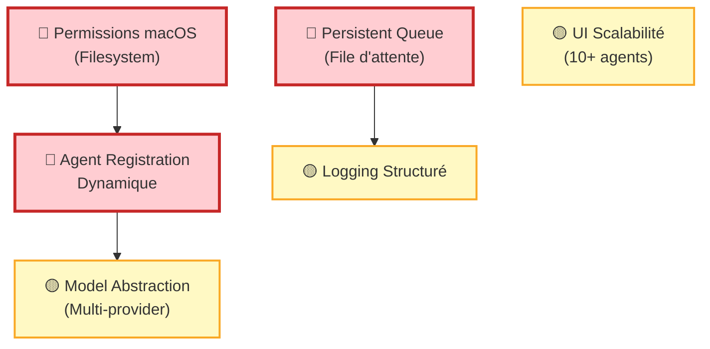
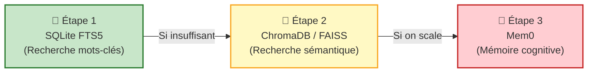
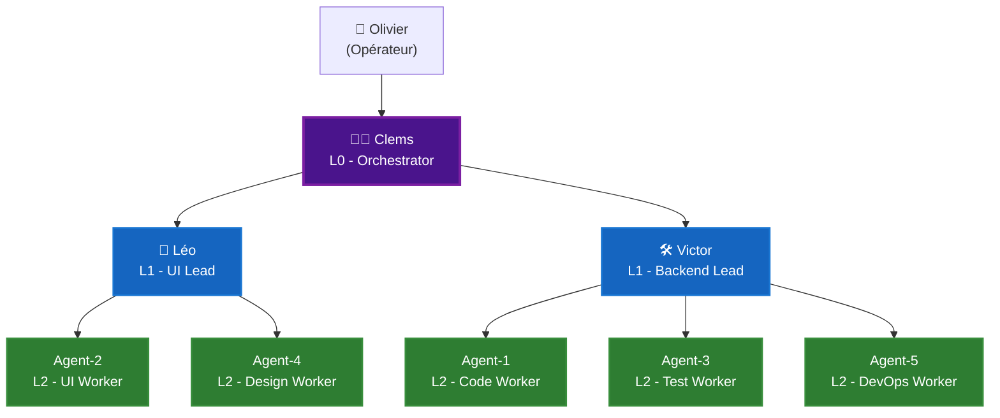
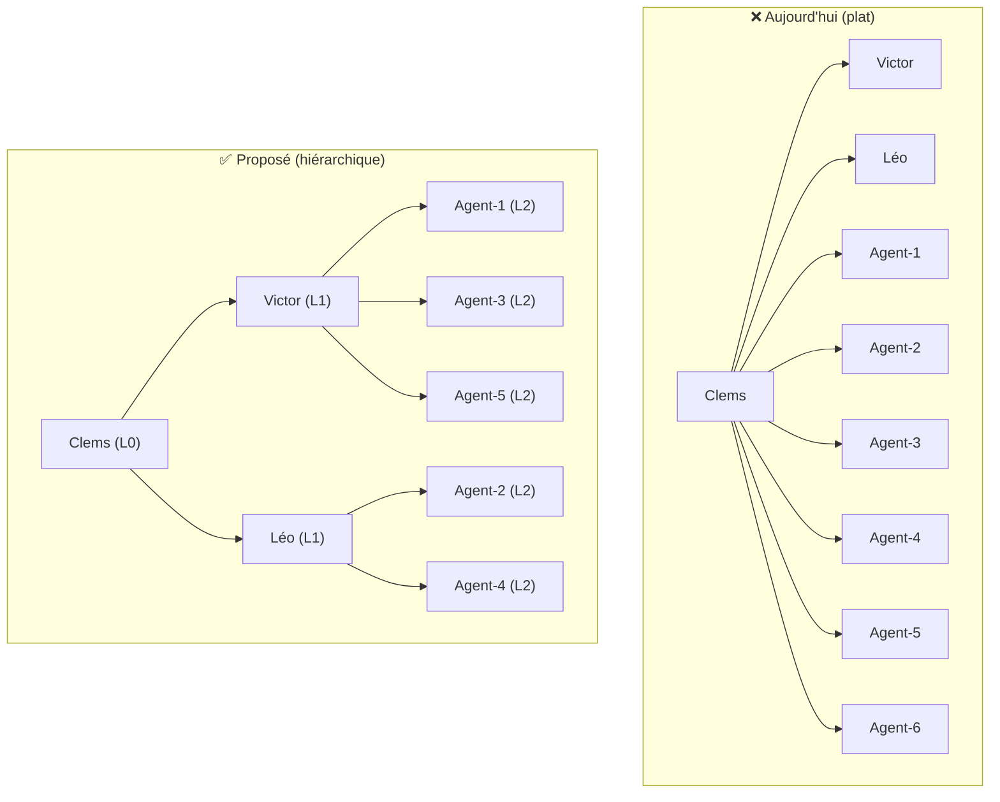
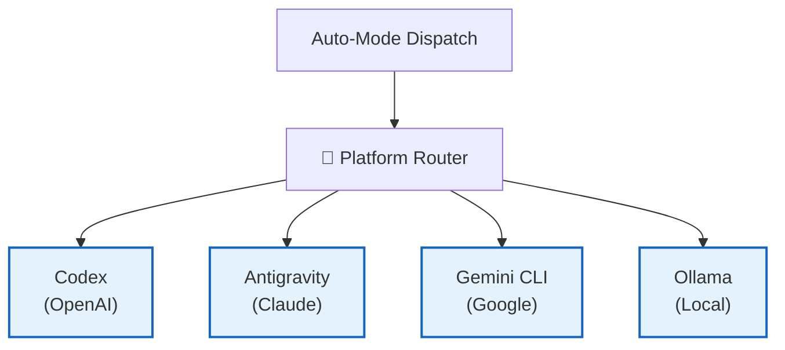
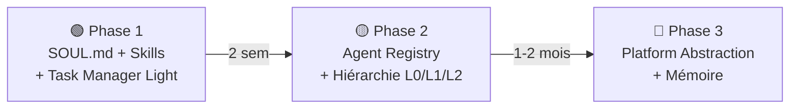

# 🔬 Recherche R1 — Deep Dive : 9 Questions Critiques

> **Phase :** Recherche Conceptuelle (ZÉRO codage)
> **Auteur :** Léo
> **Date :** 2026-02-13
> **Statut :** Analyse complète, basée sur le code source réel de Cockpit

---

## Q1 : Quelles sont les VRAIES différences entre OpenClaw et Cockpit ?

Ce n'est pas juste un diff de features. C'est une **différence philosophique fondamentale**.

### Tableau comparatif détaillé

| Dimension | OpenClaw | Cockpit (Aujourd'hui) | Écart |
|-----------|----------|----------------------|-------|
| **Architecture** | Framework client-serveur. L'agent est un process serveur qui tourne 24/7. | Application desktop Qt. Les agents n'existent que quand l'app tourne. | 🔴 Critique |
| **Runtime** | Agents persistants avec heartbeat, mémoire, et inbox permanente. | Agents éphémères : Codex/Antigravity lancés à la demande par `auto_mode.py`. | 🔴 Critique |
| **Identité Agent** | `SOUL.md` : personnalité, ton, règles, mémoire. Riche et documenté. | `state.json` : 5 champs (`phase`, `percent`, `status`, `blockers`, `current_task`). Minimaliste. | 🟡 Moyen |
| **Skills** | Marketplace de plugins installables. Standard `SKILL.md` + `AGENTS.md`. Communauté active. | `skills.json` : 5 entrées statiques (`python`, `node`, `ui`, `mcp`, `packaging`). Pas de chargement dynamique. | 🔴 Critique |
| **Mémoire** | Markdown persistant + contexte de conversation. L'agent "se souvient" entre sessions. | Fichiers projet (`STATE.md`, `PLAN.md`). Pas de mémoire cross-projet. Pas de mémoire sémantique. | 🔴 Critique |
| **Task Manager** | Dashboard temps réel : sessions actives, tokens, coûts, modèles utilisés, taux de succès. | `auto_mode_state.json` : compteurs bruts (`dispatched_total`, `skipped_total`). Pas de dashboard. | 🟡 Moyen |
| **Multi-Model** | Fleet de modèles : Claude Opus, GPT-5.3, Gemini 3, Nano Banana. Fallback automatique. | Codex binaire : `codex` ou `antigravity`. Hardcodé dans `_agent_platform()`. | 🟡 Moyen |
| **Orchestration** | Coordinator agent qui délègue. Group Chats. Swarm patterns. Workflows chaînés (Lobster shell). | `auto_mode.py` : dispatch linéaire. 1 request → 1 agent. Pas de chaînage. | 🔴 Critique |
| **Scheduling** | Cron jobs natifs. Tâches planifiées (standup, health check, rapports). | `QTimer` de 5 secondes dans `main_window.py`. Refresh bête, pas de planification. | 🟡 Moyen |
| **Org Chart** | Visualisation de la hiérarchie, relations, rôles. | Agents = liste plate dans `AgentsGridWidget`. Pas de hiérarchie. | 🟡 Moyen |
| **Scalabilité** | Testé avec 25+ agents simultanés. | Testé avec 3 agents (Clems, Victor, Léo). | 🔴 Critique |
| **Coût Tracking** | Tokens consommés, coût par session, coût total, budget alerts. | Rien. Aucun tracking de coût. | 🟡 Moyen |

### Ce que Cockpit fait MIEUX qu'OpenClaw

| Avantage Cockpit | Détail |
|------------------|--------|
| **Simplicité** | Un fichier `settings.json` + quelques `.md` = tout le projet. OpenClaw nécessite un serveur. |
| **UI Desktop** | App native Qt avec visualisation directe. OpenClaw est CLI-first. |
| **Humain dans la boucle** | L'opérateur voit tout et valide. OpenClaw est plus "fire and forget". |
| **Intake intelligent** | `BrainManager` scanne le repo, génère des questions, crée un plan. OpenClaw n'a pas ça. |

### Verdict

> Cockpit a une **meilleure UX opérateur** mais une **infrastructure agent primitive**. OpenClaw a une **infrastructure agent mature** mais une **UX opérateur basique** (CLI). L'objectif est de **prendre l'infrastructure d'OpenClaw et la mettre dans l'UX de Cockpit**.

---

## Q2 : Quels sont les principaux problèmes d'infrastructure ?

En analysant le code source, voici les **vrais** problèmes structurels :

### 🔴 Problème 1 : Agents éphémères (pas de runtime persistant)

```
# auto_mode.py, ligne 296-309 — le mapping est HARDCODÉ
def _agent_platform(agent_id: str) -> str:
    if agent_id == "leo":
        return "antigravity"
    if agent_id == "victor":
        return "codex"
    if agent_id.startswith("agent-"):
        n = int(agent_id.split("-", 1)[1])
        return "codex" if (n % 2 == 1) else "antigravity"
    return "codex"
```

**Conséquence :** On ne peut pas ajouter un agent sans modifier le code Python. Pas de découverte dynamique, pas de registration. Si on veut 10 agents, il faut modifier cette fonction.

### 🔴 Problème 2 : Pas de file d'attente persistante

Le dispatch est **synchrone et unique** : 1 tick → 1 action max (`max_actions=1`). Si Cockpit crash pendant un dispatch, la requête est perdue. Il n'y a pas de retry automatique (sauf les reminders, qui font du polling brut).

### 🔴 Problème 3 : Permissions filesystem

On l'a vu avec le chat. Le `~/Library/Application Support/Cockpit/projects` est protégé par macOS. Les scripts externes ne peuvent pas écrire. C'est un **mur** pour tout ce qui est automatisation.

### 🟡 Problème 4 : Pas de couche d'abstraction modèle

Aujourd'hui c'est "Codex" ou "Antigravity", point. Si on veut ajouter GPT, Gemini, Claude direct, ou un modèle local (Ollama), il faut tout réécrire. Il n'y a pas d'interface `ModelProvider`.

### 🟡 Problème 5 : Scalabilité UI

`AgentsGridWidget` affiche des cartes en grille. Avec 3 agents c'est joli. Avec 10, c'est scroll. Avec 25, c'est inutilisable. Il faut un système de filtrage/grouping.

### 🟡 Problème 6 : Pas de logging structuré

Les "KPI" existent dans `auto_mode.py` (`compute_run_loop_kpi`) mais ne sont ni affichés ni historisés proprement. Les compteurs sont dans un JSON plat sans timestamps.

### Résumé des priorités



---

## Q3 : Le Vector Store — Pourquoi "Explorer" ? Quelles alternatives ?

J'ai dit "Explorer" parce que c'est un choix architectural lourd. Voici **toutes** les options, pas juste ChromaDB :

### Comparaison complète des options

| Solution | Type | Taille | Serveur? | Python? | Maturité | Cas d'usage Cockpit |
|----------|------|--------|----------|---------|----------|---------------------|
| **ChromaDB** | Vector DB | ~50MB | Non | Natif | ⭐⭐⭐⭐ | Mémoire agent sémantique |
| **FAISS** (Meta) | Vector Index | ~20MB | Non | Natif | ⭐⭐⭐⭐⭐ | Recherche rapide en mémoire |
| **RAGlite** | RAG en SQLite | ~5MB | Non | Natif | ⭐⭐ | Ultra-léger, prototype |
| **Mem0 / OpenMemory** | Mémoire cognitive | ~30MB | Non | Natif | ⭐⭐⭐ | Mémoire longue durée par agent |
| **LanceDB** | Vector DB embarquée | ~15MB | Non | Natif | ⭐⭐⭐ | Alternative moderne à ChromaDB |
| **SQLite + FTS5** | Full-text search | 0MB | Non | Standard | ⭐⭐⭐⭐⭐ | Recherche par mots-clés (pas sémantique) |
| **Rien (Status quo)** | Fichiers MD | 0MB | Non | N/A | ∞ | `grep` dans les fichiers |

### Pourquoi "Explorer" et pas "Adopter" ?

1. **Dépendance au modèle d'embedding.** Un vector store sans embeddings, ça ne sert à rien. Il faut un modèle comme `all-MiniLM-L6-v2` (~80MB). C'est léger, mais c'est du machine learning dans un outil desktop. Est-ce qu'on veut ça ?

2. **Le status quo fonctionne.** Aujourd'hui, `grep` + `STATE.md` + `PLAN.md` couvre 80% des besoins. Le vector store règle les 20% restants (recherche cross-projet, mémoire longue). Vaut-il cette complexité ?

3. **Alternative intermédiaire : SQLite FTS5.** C'est de la recherche par mots-clés (pas sémantique), mais c'est 0 dépendance et très rapide. Ça couvre peut-être 90% des cas.

### Ma recommandation révisée



**Verdict révisé : Commencer par SQLite FTS5. Passer à ChromaDB seulement si la recherche par mots-clés ne suffit pas.**

---

## Q4 : Pourquoi l'Org Chart est limité à 3 ? Comment scaler ?

### Le vrai problème

L'Org Chart n'est pas limité à 3 par design. Il est limité à 3 parce que **le code ne connaît que 3 agents**. Voici pourquoi :

1. **`model.py`** — Le modèle `AgentState` est **plat**. Il n'y a pas de champ `parent`, `reports_to`, ou `level`. C'est une simple liste.

2. **`auto_mode.py`** — Le mapping est hardcodé (`leo → antigravity`, `victor → codex`). Pour ajouter `agent-5`, il faut que le code le gère (il le fait via le pattern `agent-{N}`), mais il n'y a pas de registration.

3. **`agents_grid.py`** — L'UI affiche tout en grille plate. Pas de grouping, pas de hiérarchie.

### Ce qui rend le scaling compliqué

| Obstacle | Détail | Solution |
|----------|--------|----------|
| **Pas de worker registry** | Les agents ne s'enregistrent nulle part. Cockpit les découvre en scannant les dossiers `agents/`. | Créer un `agents_registry.json` central. |
| **Pas de hiérarchie** | `AgentState` n'a pas de champ `level` ou `parent_id`. | Ajouter `level: int` et `parent_id: str\|None` au modèle. |
| **Platform hardcodée** | `_agent_platform()` est une fonction if/else. | Remplacer par un lookup dans `settings.json`. |
| **UI non-scrollable** | `AgentsGridWidget` ne gère pas bien 10+ cartes. | Ajouter un accordion ou des onglets par niveau. |

### Architecture cible pour 10+ agents



---

## Q5 : Que manque-t-il dans l'architecture ? Qu'est-ce qui ne fait pas de sens ?

### ❌ Ce qui ne fait pas de sens

1. **`demo` et `cockpit` sont deux projets différents avec des configs différentes.**
   - `cockpit/settings.json` a `role_skill_packs` et `skills_policy`.
   - `demo/settings.json` n'a RIEN de ça.
   - Résultat : les fonctionnalités marchent sur un projet et pas l'autre. Incohérent.

2. **`brainfs/skills/skills.json` existe mais n'est jamais chargé dynamiquement.**
   - `load_profile_context()` dans `brainfs.py` lit les profils, mais les skills ne sont pas injectés dans les agents. C'est du décor.

3. **"Auto-mode" essaie de faire trop choses à la fois.**
   - `auto_mode.py` fait 1119 lignes. Il gère : dispatch, reminders, lifecycle, KPI, counters, state persistence, prompt formatting. C'est un God Object.

4. **Les "phases" (`Plan → Implement → Test → Review → Ship`) sont globales.**
   - Un agent peut être en "Implement" pendant qu'un autre est en "Review" sur une autre tâche. Mais les phases sont au niveau projet, pas au niveau agent/issue.

### ✅ Ce qui manque

| Manque | Impact | Priority |
|--------|--------|----------|
| **Agent Registry** (registration dynamique) | Impossible de scaler au-delà de 3 sans modifier le code | 🔴 |
| **Hiérarchie explicite** (`parent_id`, `level`) | Pas d'Org Chart, pas de délégation structurée | 🔴 |
| **Model Provider interface** | Impossible d'ajouter GPT/Gemini/Ollama | 🟡 |
| **Event Bus / Message Queue** | Dispatch synchrone = fragile | 🟡 |
| **SOUL.md ou Agent Profile riche** | Agents sans personnalité ni mémoire | 🟡 |
| **Budget/Quota tracking** | Aucune visibilité sur les coûts | 🟡 |

---

## Q6 : Pourquoi le Task Manager est dans "Planifier" ? Simplification ?

### Pourquoi j'ai dit "Planifier" (Phase 2-3)

Parce que le Task Manager **complet** (comme OpenClaw avec Tokens/Coûts/Sessions) nécessite :
1. Un backend de logging structuré (chaque action → un event)
2. Un nouveau panneau Qt complet (widget, layout, refresh)
3. Du tracking de tokens qui n'existe nulle part dans Cockpit

### MAIS — Version simplifiée = Phase 1

Si on enlève le token tracking et qu'on simplifie la terminologie :

| Terme OpenClaw | Terme Cockpit (proposé) |
|----------------|------------------------|
| Active | **En mission** |
| Idle | **Au repos** |
| Standby | **En attente d'info** |
| Total Sessions | **Missions terminées** |
| Tokens Used | ~~Supprimé~~ (pour l'instant) |
| Total Cost | ~~Supprimé~~ (pour l'instant) |

Le Task Manager simplifié = **un simple tableau dans le Roadmap** avec :

```
┌─────────────┬──────────────┬───────────────────────┐
│ Agent       │ Statut       │ Mission               │
├─────────────┼──────────────┼───────────────────────┤
│ 👨‍✈️ Clems    │ 🟢 En mission │ Orchestration R1      │
│ 🎨 Léo      │ 🟡 Au repos   │ —                     │
│ 🛠️ Victor   │ 🔵 En attente │ Attend review Olivier │
│ Agent-1     │ 🟢 En mission │ Fix CI pipeline       │
│ Agent-3     │ ⚪ Au repos   │ —                     │
└─────────────┴──────────────┴───────────────────────┘
```

**Les données existent déjà** dans `auto_mode_state.json` (`requests`, `dispatched`, `status`). Il suffit de les afficher.

**Verdict révisé : 🟢 ADOPTER (version simplifiée, sans tokens) — Phase 1.**

---

## Q7 : Faut-il plus d'agents L2 pour gérer les agents L3 ?

### La question fondamentale

> Est-ce que Clems (L0) → Léo + Victor (L1) suffit quand on a 10+ agents L2 ?

**Non.** Et voici pourquoi :

### Le problème du "span of control"

En management, une personne peut gérer efficacement **5-7 rapports directs**. Au-delà, la qualité baisse. Pour les agents AI, c'est pire : le contexte window est limité.



### Configuration recommandée

| Niveau | Rôle | Responsabilité | Nb max de rapports |
|--------|------|---------------|-------------------|
| **L0** | Clems (Orchestrator) | Planification, décisions, allocation | 2-4 L1 |
| **L1** | Victor (Backend Lead) | Supervise les workers backend. Revoit leur code. | 3-5 L2 |
| **L1** | Léo (UI Lead) | Supervise les workers UI/Design. Valide la qualité visuelle. | 3-5 L2 |
| **L1** | (Nouveau?) QA Lead | Supervise les workers de test. Gère les rapports de bug. | 3-5 L2 |
| **L2** | Agent-1, Agent-3... | Exécutent les tâches. Rapportent à leur L1. | 0 (workers) |

### Réponse courte

**Oui**, il faut potentiellement un 3ème L1 (ex: "QA Lead" ou "Data Lead") quand on dépasse 6 agents L2. Sinon Victor et Léo sont surchargés et Clems perd le contrôle.

---

## Q8 : Meilleure configuration + skills pour Clems et les L1 ?

### Clems (L0 — Orchestrator)

```json
{
  "agent_id": "clems",
  "level": 0,
  "role": "Tech Lead / Orchestrator",
  "focus": "Planification, allocation de ressources, décisions architecturales",
  "skills": [
    "project-management",
    "decision-making",
    "agent-delegation",
    "risk-assessment",
    "doc-generation"
  ],
  "rules": [
    "Ne jamais coder directement",
    "Toujours vérifier le budget avant de lancer un agent",
    "Consolider les rapports L1 chaque matin",
    "Décisions documentées dans DECISIONS.md"
  ],
  "delegates_to": ["victor", "leo"]
}
```

### Victor (L1 — Backend Lead)

```json
{
  "agent_id": "victor",
  "level": 1,
  "role": "Backend Engineering Lead",
  "focus": "Architecture backend, code quality, CI/CD",
  "platform": "codex",
  "skills": [
    "python-expert",
    "testing-pytest",
    "git-workflow",
    "security-audit",
    "code-review"
  ],
  "rules": [
    "Toujours écrire des tests",
    "Jamais de commit sans review (ou self-review documenté)",
    "Rapporter les blockers à Clems sous 30 min"
  ],
  "manages": ["agent-1", "agent-3", "agent-5"]
}
```

### Léo (L1 — UI/UX Lead)

```json
{
  "agent_id": "leo",
  "level": 1,
  "role": "UI/UX Architecture Lead",
  "focus": "Design system, user experience, visual quality",
  "platform": "antigravity",
  "skills": [
    "qt-styling",
    "ux-audit",
    "screenshot-verification",
    "figma-design",
    "accessibility-check"
  ],
  "rules": [
    "Paper Ops only (pas de fioritures)",
    "Contraste minimum 4.5:1",
    "Ne pas bloquer le thread principal",
    "Friction report pour chaque release"
  ],
  "manages": ["agent-2", "agent-4"]
}
```

### Faut-il revoir l'organisation ?

**Oui**, sur 3 points :

1. **Ajouter un `level` et `manages` au modèle agent.** Aujourd'hui `AgentState` n'a pas ça.
2. **Rendre le platform mapping configurable** (pas hardcodé dans Python).
3. **Séparer Clems de l'exécution.** Aujourd'hui Clems écrit dans les fichiers directement au même niveau que Victor. Il devrait uniquement déléguer.

---

## Q9 : La majorité des agents est sur Codex — Implications ?

### L'état actuel (code source)

```python
# auto_mode.py — Le mapping
# victor     → codex
# leo        → antigravity
# agent-1    → codex (impair)
# agent-2    → antigravity (pair)
# agent-3    → codex (impair)
# agent-4    → antigravity (pair)
# agent-5    → codex (impair)
# default    → codex
```

**Résultat :** Sur 7 agents possibles, **5 sont sur Codex** et **2 sur Antigravity**.

### Implications de cette répartition

| Aspect | Conséquence | Risque |
|--------|-------------|--------|
| **Codex = le runtime principal** | La majorité du travail passe par Codex. Si Codex est down, tout s'arrête. | 🔴 Single point of failure |
| **Antigravity = runtime secondaire** | Seulement Léo et les agents pairs. Sous-utilisé. | 🟡 Gaspillage de capacité |
| **Pas de fallback** | Si Codex échoue, pas de bascule vers Antigravity (ou autre). | 🔴 Fragilité |
| **Coûts concentrés** | Tous les tokens Codex sont sur le même compte/quota. | 🟡 Risque de throttling |
| **Prompts différents** | Codex et Antigravity n'ont pas le même format de prompt. `format_prompt()` est unique mais les runners sont différents. | 🟡 Maintenance double |

### Ce qu'il faut intégrer dans l'architecture

1. **Abstraction de plateforme.** Un agent ne devrait pas "être" Codex ou Antigravity. Il devrait avoir un `preferred_platform` et un `fallback_platform`.

2. **Multi-runtime.** Si on ajoute Gemini CLI ou Claude direct, il faut un `RuntimeProvider` interface :



3. **Quota par plateforme.** Cockpit doit tracker combien chaque plateforme a consommé et répartir intelligemment.

---

## 📋 Synthèse : Les 5 chantiers prioritaires

En prenant en compte les 9 questions :

| # | Chantier | Problèmes résolus | Effort |
|---|----------|-------------------|--------|
| **1** | **Agent Registry + Hiérarchie** (Q4, Q5, Q7) | Scaling, Org Chart, delegation | 🟡 |
| **2** | **SOUL.md + Skills dynamiques** (Q1, Q8) | Identité, compétences, personnalisation | 🟢 |
| **3** | **Task Manager simplifié** (Q6) | Visibilité, sans tokens | 🟢 |
| **4** | **Platform Abstraction** (Q9) | Multi-runtime, fallback, robustesse | 🔴 |
| **5** | **Mémoire progressive** (Q3) | SQLite FTS5 → ChromaDB si besoin | 🟡 |


